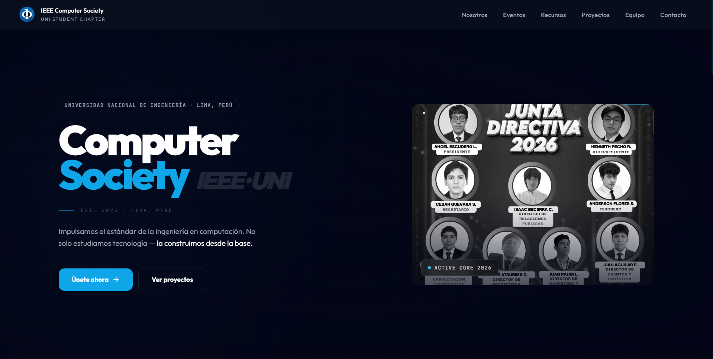
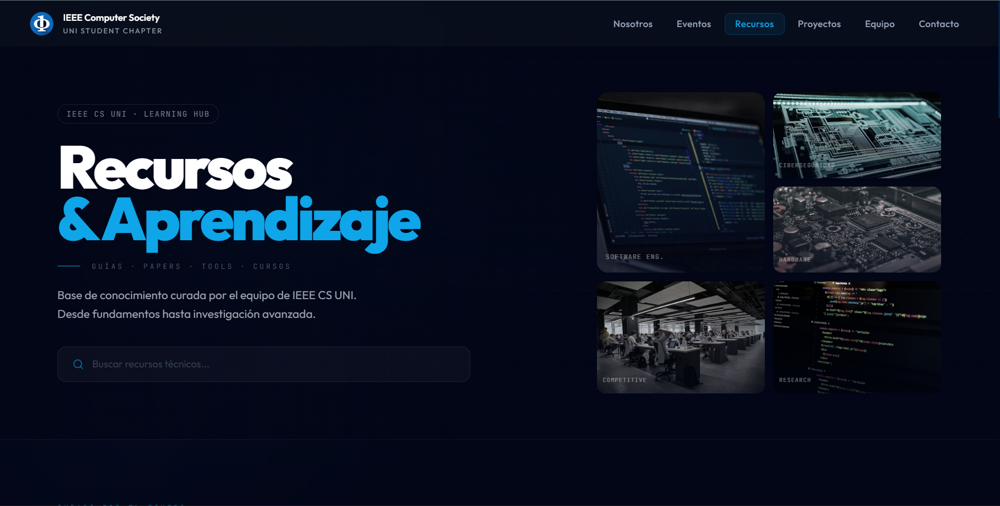
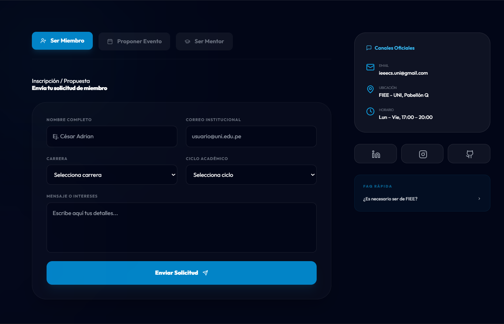
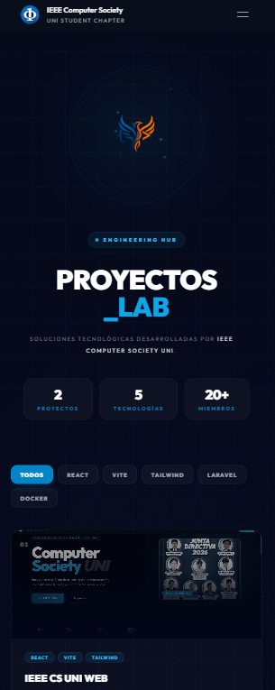

<div align="center">

# IEEE CS UNI — Plataforma Web

**Sitio institucional del capítulo estudiantil IEEE Computer Society**  
**Universidad Nacional de Ingeniería · Lima, Perú**

[](https://react.dev)
[](https://vitejs.dev)
[](https://tailwindcss.com)
[](https://laravel.com)
[](https://www.mysql.com)
[](https://vercel.com)
[](https://railway.app)
[](LICENSE)

[Live Site](https://cyberstill-gmbh.github.io/ieeecsuni.github.io) &nbsp;·&nbsp; [Repository](https://github.com/CyberStill-GmbH/ieeecsuni.github.io)

</div>

---

## Overview

Official web platform of the IEEE Computer Society student chapter at Universidad Nacional de Ingeniería. The platform serves as the chapter's institutional presence — communicating its identity, events, and team to prospective and current members — with a contact and registration form backed by a production Laravel REST API.

Built end-to-end as Web Lead of the chapter: system design, frontend, backend API, and cloud deployment.

---

## Preview

<!-- Landing page — full desktop view (1440px) -->



<br>

<!-- Hero section close-up or design detail -->



<br>

<!-- Contact / registration form — with data entered -->



<br>

<!-- Mobile responsive view -->



---

## Stack

| Layer | Technology |
|---|---|
| Frontend | React 18 + Vite |
| Styling | Tailwind CSS |
| Routing | React Router v6 |
| HTTP Client | Axios |
| Backend | Laravel 13 |
| Database | MySQL 8 |
| Frontend Deploy | Vercel |
| Backend Deploy | Railway |

---

## Features

**Institutional landing page**

Full single-page application covering the chapter's hero, About, Events, and Team sections. The design system is built entirely on Tailwind CSS using a dark glassmorphism aesthetic — translucent card layers, low-opacity borders, and IEEE blue as the primary accent. The layout is mobile-first and fully responsive across all breakpoints.

**Contact and registration form**

Integrated form with client-side validation on the frontend and server-side validation via Laravel Form Requests on the backend. Submitted data is persisted to MySQL through Eloquent ORM. Cross-origin requests between the Vercel frontend and the Railway backend are handled through Laravel's CORS configuration.

---

## Architecture

```
+--------------------------------+
|  React SPA  ·  Vercel         |
|  Vite + Tailwind CSS          |
|                                |
|  Landing  ·  Sections  ·  Form |
+----------------+---------------+
                 |
                 |  POST /api/contact
                 |  application/json  ·  CORS
                 |
+----------------v---------------+
|  Laravel 11 API  ·  Railway   |
|                                |
|  Form Request  ·  Controller  |
|  Eloquent ORM                 |
+----------------+---------------+
                 |
         +-------v--------+
         |   MySQL 8      |
         |   Railway      |
         +----------------+
```

---

## Project Structure

```
ieeecsuni.github.io/
|
+-- ieeeCSUNI-fronted/
|   +-- src/
|   |   +-- assets/          # Logo, images
|   |   +-- components/      # Navbar, Footer, landing sections
|   |   +-- pages/           # Home
|   |   +-- services/        # Axios — API layer
|   +-- tailwind.config.js
|   +-- vite.config.js
|   +-- package.json
|
+-- ieeeCSUNI-backend/
    +-- app/
    |   +-- Http/
    |   |   +-- Controllers/  # ContactController
    |   |   +-- Requests/     # Form validation
    |   +-- Models/
    +-- routes/
    |   +-- api.php
    +-- .env.example
```

---

## Local Setup

**Frontend**

```bash
cd ieeeCSUNI-fronted
npm install
cp .env.example .env.local
# Set VITE_API_URL=http://localhost:8000/api
npm run dev
```

**Backend**

```bash
cd ieeeCSUNI-backend
composer install
cp .env.example .env
php artisan key:generate
# Configure DB_* credentials in .env
php artisan migrate
php artisan serve
```

Requirements: Node 20+ · PHP 8.2+ · Composer 2+ · MySQL 8

---

## Environment Variables

**Frontend — `.env.local`**

```env
VITE_API_URL=http://localhost:8000/api
```

**Backend — `.env`**

```env
APP_URL=http://localhost:8000

DB_CONNECTION=mysql
DB_HOST=127.0.0.1
DB_PORT=3306
DB_DATABASE=ieee_cs_uni
DB_USERNAME=root
DB_PASSWORD=

FRONTEND_URL=http://localhost:5173
```

---

## Roadmap

### v1.0 `released`

Full landing page with dark glassmorphism design system, contact and registration form, and production deployment on Vercel and Railway.

---

### v2.0 `planned`

**Scroll animations and motion design**  
Implement entrance animations triggered on scroll using the Intersection Observer API — section reveals, staggered card appearances, and subtle parallax on the hero. All transitions respecting `prefers-reduced-motion`.

**Performance optimization**  
Lazy loading for below-the-fold sections, image optimization pipeline with WebP conversion via Vite plugins, and Lighthouse score targets of 95+ across Performance, Accessibility, and Best Practices.

**SEO and meta layer**  
Dynamic `<head>` management with `react-helmet-async`: Open Graph tags, Twitter Card metadata, canonical URLs, and a structured `schema.org` JSON-LD block describing the chapter as an organization. Enables proper link previews when shared on social media.

**Internationalization**  
Bilingual support (Spanish / English) using `react-i18next` with language detection from browser preferences and a toggle in the navbar. All static strings extracted to translation files.

**Dynamic content from API**  
Events and Team sections currently rendered from static data. Replace with API-driven content so admins can update events and team members without touching the frontend codebase. Includes loading skeletons and error boundary handling.

**Email delivery on form submission**  
Integrate Laravel Mail with a transactional provider (Resend or Mailgun) to send a confirmation email to the submitter and an internal notification to the chapter board on each new registration.

---

## License

MIT © 2025 IEEE Computer Society UNI Student Chapter

---

<div align="center">
<sub>IEEE Computer Society · Universidad Nacional de Ingeniería · Lima, Perú</sub>
</div>